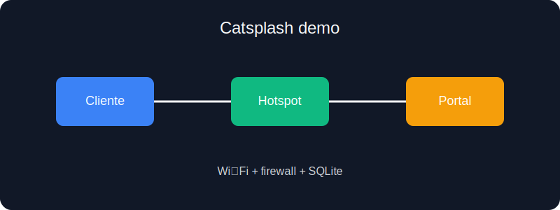
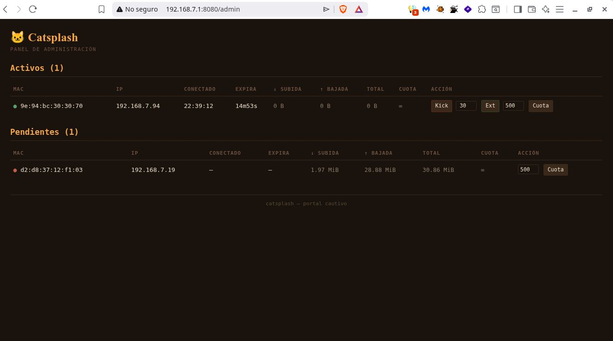
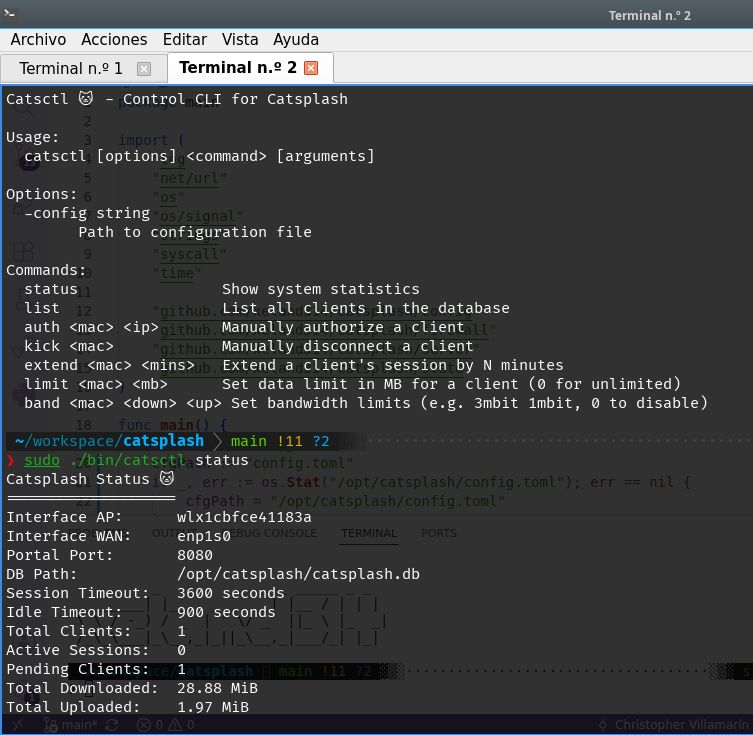
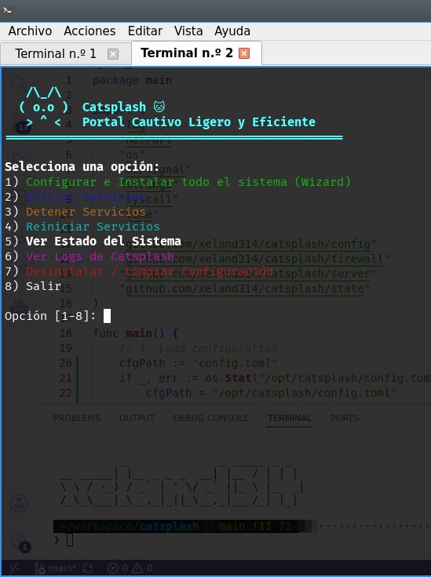

# Catsplash 🐱

> Catsplash es un portal cautivo ligero para Linux que permite abrir una red temporal, bloquear el acceso a Internet hasta que el usuario acepta los términos y liberar el tráfico de forma segura con Go, SQLite y iptables.



## Features
- Portal cautivo compatible con el flujo de Captive Network Assistant de Android e iOS.
- Gestión de sesiones y clientes con SQLite, expiración por tiempo absoluto e inactividad.
- Herramienta de control `catsctl` para revisar estado, listar clientes y gestionar sesiones.
- Instalador guiado con `setup.sh` que prepara hostapd, dnsmasq, reglas de firewall y la configuración del sistema.
- Panel de administración con contraseña:



## Architecture

```text
Cliente Wi‑Fi ──> Punto de Acceso (hostapd) ──> Catsplash
                           │                         │
                           │                         ├─> Firewall (iptables)
                           │                         ├─> Base de datos SQLite
                           │                         └─> Portal web /auth
```

## Requerimientos
- Linux con privilegios de root.
- Debian/Ubuntu recomendado para el asistente de instalación.
- Dependencias del sistema: `hostapd`, `dnsmasq`, `iptables`, `gcc`, `make`, `sqlite3` y Go 1.26+.
- Compilador compatible con CGO, ya que el driver de SQLite requiere compilación nativa.

## Instalación
```bash
git clone https://github.com/xeland314/catsplash.git
cd catsplash
make build
sudo ./setup.sh
```

El build deja los binarios en la carpeta `bin/` y el instalador copia los artefactos a `/opt/catsplash`. Sigue los pasos que te indica setup.sh hasta el final. Recuerda que es muy probable que necesites lo básico en configuración de redes.

## Uso
```bash
sudo ./bin/catsplash
sudo ./bin/catsctl status
sudo ./bin/catsctl list
```





## Configuración
El asistente crea un archivo de configuración en `/opt/catsplash/config.toml` y una base de datos en `/opt/catsplash/catsplash.db`. Si prefieres ajustar manualmente el entorno, puedes editar la configuración generada y reiniciar el servicio.

## Performance

### Rendimiento y Pruebas de Estrés (Performance & Stress Testing)

Catsplash está diseñado bajo una filosofía de consumo mínimo de recursos, haciéndolo ideal para operar de manera robusta en entornos de producción sobre hardware heredado o routers empotrados de bajos recursos.

Para validar su estabilidad, control de concurrencia y eficiencia en el manejo de memoria bajo escenarios críticos, se diseñó un arnés de pruebas automatizado basado en **Network Namespaces aislados**.

### Arquitectura del Laboratorio de Pruebas
Las pruebas simulan una topología de red real completa dentro del Kernel de Linux, evitando alterar el entorno de red de la máquina anfitriona:
* **`ns_router`**: Contenedor de red aislado que ejecuta Catsplash clonando interfaces de producción (`wlx...` para el Access Point y `enp...` para la salida WAN).
* **`ns_wan`**: Servidor que simula internet público mapeando destinos externos falsos (ej. `8.8.8.8`).
* **`ns_client [1..100]`**: 100 espacios de red independientes, cada uno configurado con su propia IP y dirección MAC única, interactuando en paralelo.

**Hardware de prueba:**

| Componente | Detalle |
|---|---|
| CPU | Intel Core 2 Duo E7400 @ 2.79 GHz (2 núcleos) |
| RAM | 3.58 GiB (ya al 83% de uso antes de la prueba) |
| Disco | ext4, 100 GiB |
| OS | Debian GNU/Linux 13 (trixie), kernel 6.12 |

---

### Test 1: Concurrencia por Ráfaga Masiva (Burst Concurrency)
Este escenario simula el "peor caso posible": **100 clientes concurrentes** enviando una petición de autenticación HTTP POST simultáneamente en el mismo segundo.

#### Monitoreo de Recursos del Proceso (Catsplash Backend)

| Estado / Evento | % CPU | RAM Real (RSS) | RAM Virtual (VIRT) |
| :--- | :---: | :---: | :---: |
| **Reposito Inicial** | 0.0% | ~8.7 MB | ~1.7 GB |
| **Pico Ráfaga #1** | 13.6% | ~11.0 MB | ~2.3 GB |
| **Estabilización Post-Ráfaga #1** | 0.0% | ~17.0 MB | ~2.4 GB |
| **Pico Ráfaga #2 (Re-auth)** | 10.0% | ~23.5 MB | ~3.1 GB |

#### Análisis de Métricas de Recursos:
* **Eficiencia de CPU:** El procesamiento de las 100 solicitudes concurrentes (apertura de sockets TCP, parseo HTTP, consultas de seguridad e inyección de reglas de firewall) apenas requirió un pico máximo del **13.6% de CPU**, demostrando un excelente aprovechamiento de la concurrencia nativa de las Goroutines.
* **Gestión de Memoria (Residente vs Virtual):** El consumo real físico (RSS) se mantuvo contenido por debajo de los **24 MB** inclusive tras ráfagas consecutivas. El incremento escalonado de 8.7MB a 17MB y finalmente 23.5MB refleja el comportamiento óptimo del asignador de memoria de Go, el cual retiene páginas del sistema para mitigar la sobrecarga de futuras asignaciones.

#### Tiempos de Respuesta y Latencia (Métricas HTTP)

Las peticiones fueron inyectadas en paralelo a través de curls nativos desde cada namespace de cliente. A continuación se detallan los percentiles de respuesta obtenidos en dos ráfagas sucesivas:

| Métrica de Latencia | Ráfaga #1 (Limpia) | Ráfaga #2 (Concurrencia Sobrepuesta) |
| :--- | :---: | :---: |
| **Peticiones Exitosas (HTTP 200)** | 100 / 100 | 100 / 100 |
| **Tiempo Mínimo** | 0.1875 s | 0.4167 s |
| **Percentil 50 (p50)** | 1.3362 s | 4.7038 s |
| **Percentil 95 (p95)** | 1.9375 s | 5.3209 s |
| **Percentil 99 (p99) / Máximo** | 2.3379 s | 5.7166 s |

#### Conclusiones del Test de Estrés:
1. **Tolerancia a Fallos del 100%:** En ninguna de las corridas se registraron caídas de sockets, timeouts o errores internos (0% de fallos HTTP). Todos los clientes fueron procesados exitosamente.
2. **Cola de Espera Estructural (I/O Bound):** El incremento en la latencia de la segunda corrida (p50 de 4.7s) demuestra que el cuello de botella del sistema no es el código del portal, sino el bloqueo secuencial a nivel de kernel durante la inserción masiva de reglas de `iptables` y las colas de escritura sincrónica en el almacenamiento de SQLite. Este comportamiento es esperable y perfectamente seguro para la experiencia del usuario final en despliegues reales.

## Contribuir
Consulta [CONTRIBUTING.md](CONTRIBUTING.md).

## Licencia
MIT
